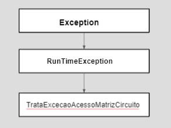

# Corridinha da Massa

Corrida da massa é um jogo de corrida em que o jogador personifica um piloto que
participa de uma competição de corrida com obstáculos. Mas essa não é uma
corrida normal, pois a vida do piloto depende dele completar o circuito
que é imprevisível e cheio de perigos. No circuito há obstáculos, sendo alguns
apenas muros intransponíveis enquanto outros labaredas de fogo mortais.
Há também, no circuito, porções mágicas que dotam o carro de habilidades
especiais e que podem ser essenciais para a sobrevivência do piloto.

# Equipe Peixonauta
Pablo Areia Delgado. R.: 223037

Randerson Araújo de Lemos. RA.: 103897

# Vídeos do Projeto
## Vídeo da Prévia
[vídeo](https://www.youtube.com/watch?v=wtWPpYuzdb8)

## Vídeo do Jogo
[vídeo](https://youtu.be/vfONENL0wm4)

# Slides do Projeto
## Slides da Prévia
[apresentação](./assets/previa)

## Slides da Apresentação Final
[apresentação](./assets/final)

# Relatório de Evolução
As princiapais mudanças que o projeto sofreu ao longo do seu desenvolvimento foram
relacionadas com a arquitetura do programa. Anteriormente, a parte de Visualização
(VIEW) foi concebida para ter um componente específico para o gerenciamento visual
do circuito e um outro para o gerenciamento visual do piloto. Esses dois componentes
se comunicariam com o componente Painel e este, juntando as informações visuais
disponibilizadas, apresentaria ao usuário os elementos visuais do jogo. A arquitetura
original está apresentada na figura abaixo.

Depois, na nova arquitetura proposta para a parte de Visualização, ficou-se
apenas com o componente Painel, que ficou responsável, nessa nova versão, pelo
gerenciamento das informações visuais e apresentação dessas informações ao
usuário. Essa decisão veio pelo entendimento da dupla de que seria importante
manter os elementos de visualização dentro de um mesmo componente (a nova arquitetura
pode ser vista na seção Diagrama Geral do Projeto).

Outra evolução do código veio da transferência da funcionalidade
de gerenciamento de criação de novos elementos do circuito do componente Controle
para o componente Construção. A transferência foi motivada pelo aumento de
coerência das atribuições de cada componente. Com ela, toda parte de gerenciamento
de criação de novos elementos ficou com o componente Construtor, restando assim,
com o componente Controle, apenas as atribuições de controle dos estados do jogo.

# Destaques de Código
<Escolha trechos relevantes e/ou de destaque do seu código. Apresente
um recorte (você pode usar reticências para remover partes menos importantes).
Veja como foi usado o highlight de Java para o código.>

# Destaques de Pattern
Destaques de patterns adotados pela equipe. Sugestẽs de estutura

## Diagrama do Pattern
Diagrama do pattern dentro do contexto da aplicação

## Código de Pattern
Colocar código e explicação de como o Patterns foi adotado

# Conclusão e Trabalhos Futuros
Concluirmos com a finalização deste trabalho que a Orientação a Objeto é um
excelente paradigma de programação e auxilia o usuário na organização dos códigos
e seu reaproveitamento com suas ideias de Herança e Polimorfismo. Então, o desenvolvimento do jogo foi bastante facilitado por esse paradigma assim, como
também o foi, devido a padrão arquitetural Model-View-Control.

Sobre o jogo, a dupla entende que os resultados desejados fora alcançados. Uma
visualização atrativa foi alcançada, assim como uma boa jogabilidade e grau
de entretenimento. Como proposto inicialmente, é uma jogo sem complicações. É
sentar e jogar!

Pra trabalhos futuros, há a necessidade de se trabalhar para evitar que o
piloto consiga se movimentar pelas diagonais dos obstáculos. Além disso,
poderia-se pensar em um esquema de fases para o jogo, na criação de diferentes
pilotos (cada qual com uma certa especialidade) e na diversificação dos obstáculos.

# Documentação
## Diagramas
### Diagrama Geral do Projeto

## Diagrama Geral dos Componentes

## Componente `Painel`

**Ficha Técnica**
item | detalhamento
----- | -----
Classe | [Classe Painel](src/src/mc322/lab07/view/painel/Painel.java)
Autores | `<Pablo e Randerson>`
Interfaces | IPainelConstrutor   IPainelControle   IRCircuitoPainel   IRPilotoPainel

~~~java
public interface IPainel extends
  IPainelConstrutor
, IPainelControle
, IRCircuitoPainel
, IRPilotoPainel
{
}
~~~
## Componente `Elemento`

**Ficha Técnica**
item | detalhamento
----- | -----
Classe | [Classe Elemento](src/src/mc322/lab07/model/elemento/Elemento.java)
Autores | `<Pablo e Randerson>`
Interfaces |  IPilotoControle   IPilotoConstrutor   IPilotoPainel   IRCircuitoPiloto

~~~java
public interface IPiloto extends
  IPilotoControle
, IPilotoConstrutor
, IPilotoPainel
, IRCircuitoPiloto
{
}
~~~
## Componente `Circuito`

**Ficha Técnica**
item | detalhamento
----- | -----
Classe | [Classe Circuito](src/src/mc322/lab07/model/circuito/Circuito.java)
Autores | `<Pablo e Randerson>`
Interfaces | ICircuitoContrutor   ICircuitoControle   ICircuitoPainel    ICircuitoPiloto

~~~java
public interface ICircuito extends
  ICircuitoConstrutor
, ICircuitoControle
, ICircuitoPainel
, ICircuitoPiloto{
}
~~~
## Componente `Controle`

**Ficha Técnica**
item | detalhamento
----- | -----
Classe | [Classe Controle](src/src/mc322/lab07/control/controle/Controle.java)
Autores | `<Pablo e Randerson>`
Interfaces | IControleConstrutor   IRCircuitoControle   IRPilotoControle   IRPainelControle

~~~java
public interface IControle extends
  IControleConstrutor
, IRCircuitoControle
, IRPilotoControle
, IRPainelControle
{
	public void comecarJogo();
}
~~~
## Componente `Construtor`

**Ficha Técnica**
item | detalhamento
----- | -----
Classe | [Classe Construtor](src/src/mc322/lab07/control/construtor/Construtor.java)
Autores | `<Pablo e Randerson>`
Interfaces | IRCircuitoConstrutor   IRControleConstrutor   IRPilotoConstrutor   IRPainelConstrutor

~~~java
public interface IConstrutor extends
  IRCircuitoConstrutor
, IRControleConstrutor
, IRPilotoConstrutor
, IRPainelConstrutor
{
	public void construir(int maxLin, int maxCol);
}
~~~
## Detalhamento das Interfaces

### Interface `IControleConstrutor`
~~~java
public interface IControleConstrutor {
	Elemento geradorAleatorioDeElementosSemPiloto(int lin, int col);
}
~~~
Método | Objetivo
-------| --------
`geradorAleatorioDeElementosSemPiloto` | Gera um Elemento seguindo certas probabilidades   Possibilidades: Asfalto, Muro, Fogo ou Poção

### Interface `ICircuitoContrutor`
Construtor poder criar a matriz do Objeto Circuito (matriz back-end)
~~~java
public interface ICircuitoConstrutor
{
	void setMatriz(int maxLin, int maxCol, Elemento matriz[][]);
	public int getMaxLin();
	public int getMaxCol();
	public void setElemento(Elemento elemento) throws TrataExcecaoAcessoMatrizCircuito;
	public Elemento getElemento(int lin, int col) throws TrataExcecaoAcessoMatrizCircuito;
}
~~~
Método | Objetivo
-------| --------
`setMatriz` | Atualiza a matriz Circuito
`getMaxLin` | Acessa o numero de linhas da matriz Circuito
`getMaxCol` | Acessa o numero de colunas da matriz Circuito
`setElemento` | Atualiza uma posição da matriz Circuito (ou seja, um Elemento)
`getElemento` | Acessa uma posição da matriz Circuito (ou seja, um Elemento)

### Interface `ICircuitoControle`
Controle ter acesso a informações sobre a matriz e poder atualizá-la
~~~java
public interface ICircuitoControle {
	public int getMaxLin();
	public int getMaxCol();
	void setElemento(Elemento elemento)  throws TrataExcecaoAcessoMatrizCircuito;
	public Elemento getElemento(int lin, int col) throws TrataExcecaoAcessoMatrizCircuito;

}
~~~
Método | Objetivo
-------| --------
`getMaxLin` | Acessa o numero de linhas da matriz Circuito
`getMaxCol` | Acessa o numero de colunas da matriz Circuito
`setElemento` | Atualiza uma posição da matriz Circuito (ou seja, um Elemento)
`getElemento` | Acessa uma posição da matriz Circuito (ou seja, um Elemento)

### Interface `ICircuitoPainel`
Interligar as matrizes back-end e front-end
~~~java
public interface ICircuitoPainel
{
	public int getMaxLin();
	public int getMaxCol();
	public Elemento getElemento(int lin, int col) throws TrataExcecaoAcessoMatrizCircuito;
}
~~~
Método | Objetivo
-------| --------
`getMaxLin` | Acessa o numero de linhas da matriz Circuito
`getMaxCol` | Acessa o numero de colunas da matriz Circuito
`getElemento` | Acessa uma posição da matriz Circuito (ou seja, um Elemento)

### Interface `ICircuitoPiloto`
Piloto e Circuito são independentes no código, o objeto Piloto sabe onde ele está, mas precisa de informações do Circuito para conhecer os arredores
~~~java
public interface ICircuitoPiloto
{
	public int getMaxLin();
	public int getMaxCol();
	public Elemento getElemento(int lin, int col) throws TrataExcecaoAcessoMatrizCircuito;
}
~~~
Método | Objetivo
-------| --------
`getMaxLin` | Acessa o numero de linhas da matriz Circuito
`getMaxCol` | Acessa o numero de colunas da matriz Circuito
`getElemento` | Acessa uma posição da matriz Circuito (ou seja, um Elemento)

### Interface `IPilotoConstrutor`
Construtor poder criar o Objeto Piloto
~~~java
public interface IPilotoConstrutor {
	public void setPosicao(int lin, int col);
}
~~~
Método | Objetivo
-------| --------
`setPosicao` | Atualiza a posição do piloto (essa informação é guardada no Piloto)

### Interface `IPilotoControle`
Controle poder ter as informações do piloto e poder atualizá-lo
~~~java
public interface IPilotoControle {
	public void moverParaCima();
	public void moverParaBaixo();
	public void moverParaEsquerda();
	public void moverParaDireita();
	public int getLin();
	public int getCol();
	public void setImagemIcon1();
	public void setImagemIcon2();
	public void setImagemIcon3();
	public void setPosicao(int lin, int col);
	public void setPoderzin(int valor);
	public int getPoderzin();
}
~~~
Método | Objetivo
-------| --------
`moverParaCima` | Move o piloto para cima se possível
`moverParaBaixo` | Move o piloto para baixo se possível
`moverParaEsquerda` | Move o piloto para esquerda se possível
`moverParaDireita` | Move o piloto para direita se possível
`getLin` | Acessa a linha que o Elemento está
`getCol` | Acessa a coluna que o Elemento está
`setImagemIcon1,2,3` | Acessam imagens específicas (1,2 ou 3) (arquivos de imagem que serão incrementados na interface gráfica)
`setPosicao` | Atualiza a posição do piloto (essa informação é guardada no Piloto)
`setPoderzin` | Dispara o tempo de duração da poção -> tempo = x;
`getPoderzin` | Acessa o tempo atual restante de duração da poção

### Interface `IPilotoPainel`
O piloto só está inserido na matriz front-end, Painel pega suas informações e atualiza a matriz
~~~java
public interface IPilotoPainel
{
	public int getLin();
	public int getCol();
	public ImageIcon getImageIcon();
}
~~~
Método | Objetivo
-------| --------
`getLin` | Acessa a linha que o Elemento está
`getCol` | Acessa a coluna que o Elemento está
`getImageIcon` | Acessa a imagem de um Elemento (arquivo de imagem que será incrementado na interface gráfica)

### Interface `IPainelConstrutor`
Construtor cria o Objeto Painel (matriz front-end) sobre as condições iniciais do objeto Circuito
~~~java
public interface IPainelConstrutor
{
	public void setMatriz(int maxLin, int maxCol, JLabel matriz[][]);
}
~~~
Método | Objetivo
-------| --------
`setMatriz` | Atualiza a matriz Painel

### Interface `IPainelControle`
Controle ser capaz de atualizar a interface gráfica a cada iteração
~~~java
public interface IPainelControle
{
	public void atualizarPainel();
	public void mostrarPainel();
	public void atualizarImagemCircuitoPainel();
	public void atualizarImagemPilotoPainel();
	public void addPlayActionListener(ActionListener I);
	public void addPlayKeyListener(KeyListener I);
	public void atualizarScore(int valor);
	public void atualizarStatus(String mensagem);
}
~~~
Método | Objetivo
-------| --------
`atualizarPainel` | atualiza o estado do Painel (o que o player vai ver)
`mostrarPainel` | manda mostrar o Painel em seu estado atualizado
`atualizarImagemCircuitoPainel` | atualiza o circuito mostrado do Painel (matirz front-end) a partir do objeto Circuito (matriz back-end)
`atualizarImagemPilotoPainel` | atualiza a posição do Piloto no Painel
`addPlayActionListener` | cria um observador
`addPlayKeyListener` | cria um observador que dispara um evento quando uma tecla é apertada
`atualizarScore` | Atualiza a pontuação do player mostrado no painel
`atualizarStatus` | Atualiza o status do jogo mostrado no painel

## Plano de Exceções

### Código da Execução das Exceções
~~~java
public Elemento getElemento(int lin, int col) throws TrataExcecaoAcessoMatrizCircuito
	{
		if(matriz != null)
		{
			if(lin >= 0 & lin < maxLin & col >= 0 & col < maxCol)
			{
				return matriz[lin][col];
			}
			else
			{
				throw new TrataExcecaoAcessoMatrizCircuito("Indice de linha ou coluna fora da matriz do circuito!");
			}
		}
		return null;
	}

	public void setElemento(Elemento elemento) throws TrataExcecaoAcessoMatrizCircuito
	{
		int lin = elemento.getLin();
		int col = elemento.getCol();
		if(lin >= 0 & lin < maxLin & col >= 0 & col < maxCol)
		{
			matriz[lin][col] = elemento;
		}
		else
		{
			throw new TrataExcecaoAcessoMatrizCircuito("Indice de linha ou coluna fora da matriz do circuito!");
		}
	}
~~~

## Descrição das classes de exceção

Classe | Descrição
----- | -----
Excecoes | Engloba todas as exceções de divisões não aceitas.
RunTimeException | Trata o padrão de exceções da classe
TrataExcecaoAcessoMatrizCircuito | Indica que há acessos de pocições inválidas
